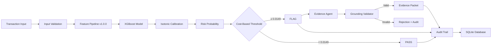

<div align="center">
  <h1>🛡️ Fraud Risk Scorer</h1>
  <p><b>An End-to-End ML Pipeline & LLM Evidence Agent for Fraud Detection</b></p>
  <p>
    <a href="https://github.com/loomking/fraud-risk-scorer/actions"></a>
    <a href="https://python.org"></a>
    <a href="https://fastapi.tiangolo.com/"></a>
    <a href="https://react.dev"></a>
    <a href="https://xgboost.readthedocs.io/en/stable/"></a>
  </p>
</div>

**Fraud Risk Scorer** is a production-ready AI risk management system designed for payment transactions. It features an XGBoost machine learning model that scores transactions for fraud risk using strictly causal, temporally-isolated features. High-risk transactions are then passed to an LLM Evidence Agent (powered by Groq) that generates structured, auditable evidence grounded *only* in the explicit transaction context. 

The entire system is deterministically auditable: from the raw input fields, through the cost-based decision threshold, to the final narrative evidence.

## Highlights
- **Strict Leakage Prevention:** Temporal data splitting and causal historical aggregations.
- **Two Model Tiers:** A 462-feature theoretical reference model, and a lightweight 22-feature live-serving model engineered exclusively from 7 realistic form fields.
- **The LLM Invariant:** The LLM *cannot* make the fraud decision; it only drafts verifiable evidence for transactions already flagged by the statistical model.
- **Cost-Optimized Thresholds:** The binary PASS/FLAG cutoff is mapped to an explicit false-positive vs. false-negative business cost curve.

## Decision Chain

```
Raw Transaction → Feature Pipeline → Risk Probability → Business Threshold → PASS/FLAG → Grounded Evidence → Source Fields → Audit Trail
```

An auditor can take any transaction and follow this chain end-to-end.

## Architecture



**Architectural invariant (Section 2.7):** The LLM cannot make the fraud decision. The ML system decides. The LLM only produces evidence for already-flagged transactions.

## Problem Statement

Fraud and chargeback risk scoring for payment transactions using the IEEE-CIS Fraud Detection dataset. The system produces:

1. **Risk Classifier** — XGBoost model scoring transactions for fraud probability using held-out, time-based evaluation
2. **Evidence Agent** — For flagged transactions, an LLM agent drafts structured evidence using only information explicitly supplied in the transaction's scoring context

## Dataset

**IEEE-CIS Fraud Detection** (Kaggle) — 590,540 transactions with 394 features.

- **Why this dataset:** Large-scale, realistic fraud detection with rich categorical features, time ordering, and ~3.5% positive rate
- **TransactionDT:** Relative time offset in seconds, NOT a real datetime. Used strictly for ordering and splitting — no calendar features derived (Section 5.1)
- **V1-V339:** Block-aligned missingness handled with sentinel values (-999), not mean imputation (Section 5.2)
- **Identity join:** Only ~24% of transactions have identity records. `has_identity` boolean feature created explicitly (Section 5.3)

## Feature Engineering

### Temporal Split (Section 9)
- **Train:** earliest ~70% (413,378 rows, 14,538 fraud at 3.52%)
- **Validation:** next ~15% (88,581 rows, 3,042 fraud at 3.43%)
- **Test:** final ~15% (88,581 rows, 3,083 fraud at 3.48%)
- No random splitting anywhere. Verified with automated tests.

### Leakage Prevention (Section 10)
- **Prediction-time check:** Every feature verified as available at transaction submission time
- **Causal historical aggregates:** Uses expanding window + shift(1) — only strictly earlier transactions per UID
- **Frequency encoding:** Fit on training data only, never the full dataset
- **Feature audit table:** Documented inline in `src/features/build_features.py`

### Imbalance Handling (Section 12)
- ~3.5% positive (fraud) rate
- XGBoost: `scale_pos_weight = neg_count / pos_count ≈ 27.4`
- Baseline LR: `class_weight='balanced'`

## MODEL & LIMITATIONS

### a. Data & Geography
The model is trained on the IEEE-CIS Fraud Detection dataset (provided by Vesta Corporation via Kaggle), which primarily contains US-centric e-commerce transactions. **Limitation:** This model has *not* been validated on Indian BFSI (Banking, Financial Services, and Insurance) transaction data. Because fraud vectors are highly region- and sector-specific, this model should be viewed as a structural demonstration of a fraud risk scoring pipeline rather than a production-ready model for the Indian market.

### b. Model Versions & The Portability Tradeoff
We deliberately developed two versions of the model to highlight the tradeoff between theoretical accuracy and operational reality:
*   **v1.0.0 (462 features):** Achieved exceptional performance (ROC-AUC 0.90, PR-AUC 0.51) by utilizing the full IEEE-CIS dataset, which includes hundreds of proprietary, anonymized "V-columns" (Vesta-engineered features). However, this model **cannot be run on live form input** because those V-features are undocumented and impossible to compute from raw transaction data. 
*   **v2.0.1 (22 features):** Engineered entirely from just 7 raw fields that a live form can realistically collect (Time, Amount, Product, Card Identifier, Network Brand, Funding Type, Email Domain). Performance dropped (ROC-AUC 0.81, PR-AUC 0.16), but this model **can run live**. We explicitly trade theoretical accuracy for portability and live-demo honesty. This is a deliberate design choice, not a shortfall we are hiding.

### c. Feature Dominance & Robustness Check
During the development of v2, we identified that an early iteration over-indexed heavily on a single feature: `amt_is_round` (0.34 importance). This is a known artifact of how the synthetic IEEE-CIS dataset generated transaction amounts, not a generalized real-world fraud signal. As a deliberate robustness check, we removed this feature and retrained the model (v2.0.1). The PR-AUC shifted by a mere 0.004 (noise level), confirming that the remaining 22 live-engineered features carry real, non-artifact signal.

### d. Model Metrics (Independently Evaluated)

> **These are two independently trained XGBoost models with separate calibration and evaluation runs. Their metrics must not be merged or presented as equivalent.**

| Metric | v1.0.0 — Primary Reference (462 features) | v2.0.1 — Lightweight Interactive Demo (20 features) |
|---|---|---|
| ROC-AUC | 0.9010 | 0.8037 |
| PR-AUC | 0.5064 | 0.1601 |
| Brier Score | 0.0225 | 0.0305 |
| Features | 462 (incl. proprietary V-columns) | 20 (live-form only) |
| Calibration | Isotonic (val set) | Isotonic (val set) |
| Temporal split | ✅ Same `temporal_split()` | ✅ Same `temporal_split()` |
| Can serve live input? | ❌ No — V-columns cannot be computed from raw data | ✅ Yes — all features derived from 7 form fields |
| Status | Archived reference model | **Live-serving on `/score`** |

v2.0.1 is a *lightweight interactive demo model*. Its lower metrics are the expected and documented consequence of restricting to only 7 raw input fields that a live form can realistically collect. It exists to demonstrate the full end-to-end pipeline (scoring → threshold → evidence → audit) on live form input, not to claim parity with the 462-feature reference model.

### e. The False-Positive Cost Curve
The most critical operational metric in fraud detection is the tradeoff between how much fraud you catch and how many legitimate transactions you burden with a manual review. Based on our untouched test set, here is the real operating envelope of the v2.0.1 model:

| Threshold | Review Rate | Fraud Capture | Precision |
| :--- | :--- | :--- | :--- |
| 0.035 | 28.2% | 73.6% | 9.1% |
| 0.040 | 22.7% | 68.0% | 10.4% |
| 0.045 | 20.7% | 65.6% | 11.0% |
| **0.050** | **19.0%** | **63.1%** | **11.5%** (Chosen Default) |
| 0.060 | 18.5% | 62.5% | 11.7% |
| 0.070 | 12.7% | 52.6% | 14.4% |
| 0.100 | 7.6% | 39.9% | 18.4% |
| 0.150 | 4.6% | 29.4% | 22.4% |

**Why 0.050?** We selected 0.050 as the default threshold because it represents a balanced operational burden (reviewing ~19.0% of transactions) while still capturing a meaningful majority (63.1%) of fraud. Pushing the threshold tighter (e.g., >0.070) enters steeply diminishing returns where we begin missing more than half of all fraudulent transactions. Crucially, the dashboard exposes this threshold as a live, adjustable control. The "right" threshold is a business decision dictated by the risk appetite and operational capacity of the fraud team, not a purely technical one.

## Evidence Agent Architecture (Section 22-26)

1. **Context builder:** Selects explicit fields from the scored transaction — no hidden DB access
2. **LLM call:** Groq API (Model: `openai/gpt-oss-120b`), temperature=0, structured JSON output
3. **Grounding validator:** Deterministic code that verifies every cited field exists in the supplied context and values match. This is the safety mechanism — not the prompt.
4. **Deliberate hallucination test:** `tests/test_agent_grounding.py` injects fabricated fields (e.g., "IP_Address_Score") and asserts the validator catches them.

## Audit Trail (Section 20)

- SQLite + SQLAlchemy with **append-only audit log** (event listeners prevent updates/deletes)
- Events: `score_computed`, `decision_made`, `evidence_generated`, `grounding_failure`
- Every score stores: model version, feature pipeline version, calibration version, threshold config version, cost assumptions, feature hash

## Reproducibility

```bash
# 1. Clone and install
git clone <repo>
cd Razorpay
uv sync --all-extras

# 2. Download dataset
kaggle competitions download -c ieee-fraud-detection -p data/raw/
cd data/raw && unzip ieee-fraud-detection.zip && cd ../..

# 3. Run full pipeline (trains model, calibrates, evaluates on all 590k rows)
uv run python -m src.pipeline_phase2 --full

# 4. Run tests (48 tests)
uv run pytest tests/ -v

# 5. Start API server (serves frontend + API)
uv run uvicorn api.main:app --reload --port 8000

# 6. Open dashboard at http://localhost:8000
```

## API Endpoints

| Method | Path | Description |
|---|---|---|
| POST | `/score` | Score a transaction (Section 28.1) |
| POST | `/evidence/{id}` | Generate evidence for flagged transaction (Section 28.2) |
| GET | `/audit/{id}` | Get audit trail (Section 28.3) |
| GET | `/report` | Get dashboard data (Section 28.4) |
| GET | `/health` | Health check |

## SCOPE NOTE

Per the project scope, the system can act as a detector, a verifier, or an auto-responder. As a deliberate design choice, **we built a pure Detector.** 

Our focus was on engineering a robust, live-compatible risk scoring engine with strict temporal isolation and a transparent false-positive cost curve. While the dashboard includes a placeholder for an "Evidence Packet" (which acts as a light, verifier-adjacent extension to ground decisions), the core architecture is entirely focused on detection and risk quantification, leaving the final verification and response to human operators.

## DEFENSE-ONLY CHECK (UI Evasion Audit)

*   **Input Fields (Txn ID, Date/Time, Amount, Product, Card Identifier, Network Brand, Funding Type, Email):** Safe. These accept only raw form data and do not expose how the model transforms them (e.g., time cyclically encoded to sine/cosine, cards mapped to historical frequencies).
*   **Top Metric Bar (Model, Threshold, Features, Total Scored):** Safe. Exposes aggregate counts and active settings, but no internal model weights.
*   **Data Table (Txn ID, Amount, Risk, Threshold, Decision):** Safe. Displays the final calibrated risk probability. It does not display the 22-dimensional feature vector, preventing attackers from mapping specific inputs to specific feature shifts.
*   **Evidence Packet (Expanded View):** Safe. Only displays high-level semantic claims and grounding validity (if generated). It does not expose SHAP values, feature importances, or decision tree paths for the specific transaction.
*   **Audit Trail (Expanded View):** Safe. Logs system events, timestamps, the active threshold, and a cryptographic `feature_hash` (useful for internal reconstructability but useless for reverse-engineering the inputs).
*   **Threshold Slider & PR Metrics:** Safe. The exposed Review Rate, Fraud Capture, and Precision are macro-level dataset statistics calculated over the entire test set. They do not help an attacker craft an evasive transaction.

**Verdict:** The dashboard interface is structurally safe. It provides enough transparency for an operator to trust the system, but zero actionable telemetry for an attacker attempting to construct a transaction that reliably scores below the threshold.

## Real vs Synthetic Components (Section 19)


| Component | Type |
|---|---|
| Transaction data | Real (IEEE-CIS) |
| Model & evaluation | Real (XGBoost on IEEE-CIS) |
| Features | Real (computed from data) |
| Business costs | Illustrative assumptions |
| Evidence narratives | AI-generated (LLM) |
| Audit trail | Real (database records) |

## Tech Stack

Python 3.11 | pandas | scikit-learn | XGBoost | FastAPI | SQLAlchemy | SQLite | Groq (LLM) | uv (dependency management)
