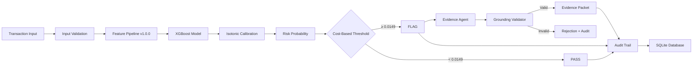

# Fraud Risk Scorer — Razorpay AI Buildathon Track 2

> **AI Risk Manager**: A fraud decision system whose predictions are temporally valid, whose threshold reflects an explicit business cost, whose evidence is mechanically grounded to supplied transaction data, and whose decisions are reconstructable after the fact.

## Decision Chain

```
Raw Transaction → Feature Pipeline → Risk Probability → Business Threshold → PASS/FLAG → Grounded Evidence → Source Fields → Audit Trail
```

A judge can take any transaction and follow this chain end-to-end.

## Architecture



**Architectural invariant (Section 2.7):** The LLM cannot make the fraud decision. The ML system decides. The LLM only produces evidence for already-flagged transactions.

## Problem Statement

Fraud and chargeback risk scoring for payment transactions using the IEEE-CIS Fraud Detection dataset. The system produces:

1. **Risk Classifier** — XGBoost model scoring transactions for fraud probability using held-out, time-based evaluation
2. **Evidence Agent** — For flagged transactions, an LLM agent drafts structured evidence using only information explicitly supplied in the transaction's scoring context

## Dataset

**IEEE-CIS Fraud Detection** (Kaggle) — 590,540 transactions with 394 features.

- **Why this dataset:** Large-scale, realistic fraud detection with rich categorical features, time ordering, and ~3.5% positive rate
- **TransactionDT:** Relative time offset in seconds, NOT a real datetime. Used strictly for ordering and splitting — no calendar features derived (Section 5.1)
- **V1-V339:** Block-aligned missingness handled with sentinel values (-999), not mean imputation (Section 5.2)
- **Identity join:** Only ~24% of transactions have identity records. `has_identity` boolean feature created explicitly (Section 5.3)

## Feature Engineering

### Temporal Split (Section 9)
- **Train:** earliest ~70% (413,378 rows, 14,538 fraud at 3.52%)
- **Validation:** next ~15% (88,581 rows, 3,042 fraud at 3.43%)
- **Test:** final ~15% (88,581 rows, 3,083 fraud at 3.48%)
- No random splitting anywhere. Verified with automated tests.

### Leakage Prevention (Section 10)
- **Prediction-time check:** Every feature verified as available at transaction submission time
- **Causal historical aggregates:** Uses expanding window + shift(1) — only strictly earlier transactions per UID
- **Frequency encoding:** Fit on training data only, never the full dataset
- **Feature audit table:** Documented inline in `src/features/build_features.py`

### Imbalance Handling (Section 12)
- ~3.5% positive (fraud) rate
- XGBoost: `scale_pos_weight = neg_count / pos_count ≈ 27.4`
- Baseline LR: `class_weight='balanced'`

## Model Approach

### Baseline (Section 13.1)
- Logistic Regression with balanced class weights
- ROC-AUC: 0.8070 — below 0.95, confirming no leakage

### Main Model (Section 13.2)
- **XGBoost** with early stopping on temporal validation
- `n_estimators=500, max_depth=6, learning_rate=0.05`
- Best iteration: 497 (PR-AUC metric)

### Test Set Performance (88,581 untouched rows)
| Metric | Value |
|---|---|
| ROC-AUC | 0.9333 |
| PR-AUC | 0.6445 |
| Recall (fraud capture) | **91.86%** (2,832 / 3,083) |
| Precision | 11.30% |
| Review rate | 28.29% |
| Brier score | 0.0181 |

Confusion matrix at threshold 0.0100: TN=63,271 | FP=22,227 | FN=251 | TP=2,832

### Probability Calibration (Section 15)
- Isotonic regression calibration on validation predictions
- Brier score improvement: 0.0567 → 0.0168

### Threshold Selection (Section 16)
- **Never 0.5.** Cost-based selection on validation data.
- FP cost: ₹50 (manual review + friction) — **illustrative assumption, NOT researched**
- FN cost: ₹12,536 (expected fraud loss). Derived from training data mean fraud amount ($149.24). Assumes dataset is in USD and 1 USD = 84.00 INR (August 2026).
- **Optimal threshold: 0.0100** (frozen before test evaluation)

### Threshold Sensitivity (Validation Set, Section 17)

> Computed on validation set (88,581 rows). Threshold selection must not use test data.

| FP Cost (₹) | Threshold | Review Rate | Fraud Capture | Cost/1000 (₹) |
|---|---|---|---|---|
| 25 | 0.0100 | 29.9% | 93.9% | 32,862 |
| 50 | 0.0100 | 29.9% | 93.9% | 39,544 |
| 100 | 0.0100 | 29.9% | 93.9% | 52,906 |

## Evidence Agent Architecture (Section 22-26)

1. **Context builder:** Selects explicit fields from the scored transaction — no hidden DB access
2. **LLM call:** Groq API, temperature=0, structured JSON output
3. **Grounding validator:** Deterministic code that verifies every cited field exists in the supplied context and values match. This is the safety mechanism — not the prompt.
4. **Deliberate hallucination test:** `tests/test_agent_grounding.py` injects fabricated fields (e.g., "IP_Address_Score") and asserts the validator catches them.

## Audit Trail (Section 20)

- SQLite + SQLAlchemy with **append-only audit log** (event listeners prevent updates/deletes)
- Events: `score_computed`, `decision_made`, `evidence_generated`, `grounding_failure`
- Every score stores: model version, feature pipeline version, calibration version, threshold config version, cost assumptions, feature hash

## Reproducibility

```bash
# 1. Clone and install
git clone <repo>
cd Razorpay
uv sync --all-extras

# 2. Download dataset
kaggle competitions download -c ieee-fraud-detection -p data/raw/
cd data/raw && unzip ieee-fraud-detection.zip && cd ../..

# 3. Run full pipeline (trains model, calibrates, evaluates on all 590k rows)
uv run python -m src.pipeline_phase2 --full

# 4. Run tests (48 tests)
uv run pytest tests/ -v

# 5. Start API server (serves frontend + API)
uv run uvicorn api.main:app --reload --port 8000

# 6. Open dashboard at http://localhost:8000
```

## API Endpoints

| Method | Path | Description |
|---|---|---|
| POST | `/score` | Score a transaction (Section 28.1) |
| POST | `/evidence/{id}` | Generate evidence for flagged transaction (Section 28.2) |
| GET | `/audit/{id}` | Get audit trail (Section 28.3) |
| GET | `/report` | Get dashboard data (Section 28.4) |
| GET | `/health` | Health check |

## Known Limitations (Section 45)

- Dataset is anonymized/masked (IEEE-CIS)
- TransactionDT has no real-world timestamp interpretation
- Synthetic UID constructed from card1+addr1+D1 (approximation)
- Business costs are estimated, not researched
- LLM evidence is AI-generated wording, not independently verified
- SQLite for development (not production-grade)
- No authentication in hackathon MVP

## Real vs Synthetic Components (Section 19)

| Component | Type |
|---|---|
| Transaction data | Real (IEEE-CIS) |
| Model & evaluation | Real (XGBoost on IEEE-CIS) |
| Features | Real (computed from data) |
| Business costs | Illustrative assumptions |
| Evidence narratives | AI-generated (LLM) |
| Audit trail | Real (database records) |

## Tech Stack

Python 3.11 | pandas | scikit-learn | XGBoost | FastAPI | SQLAlchemy | SQLite | Groq (LLM) | uv (dependency management)
